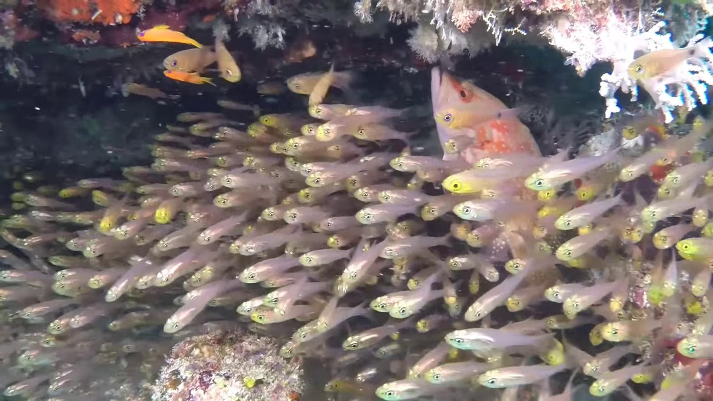
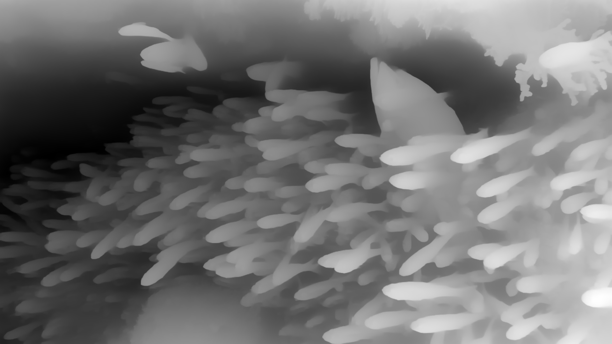
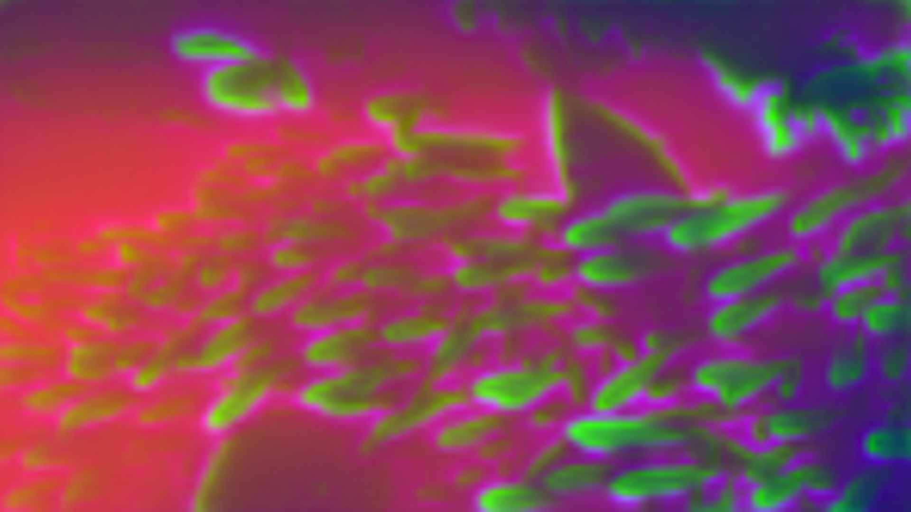
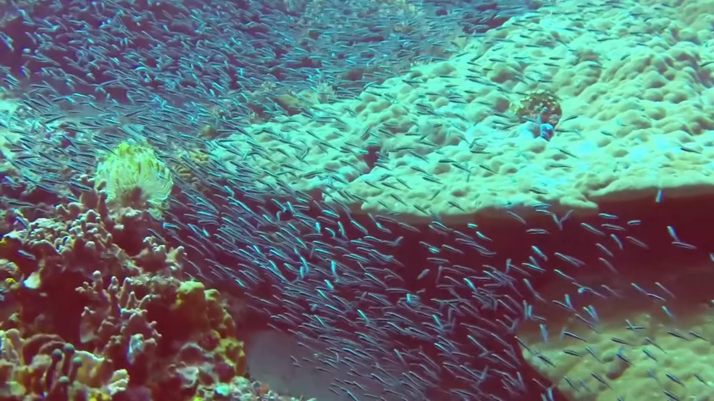
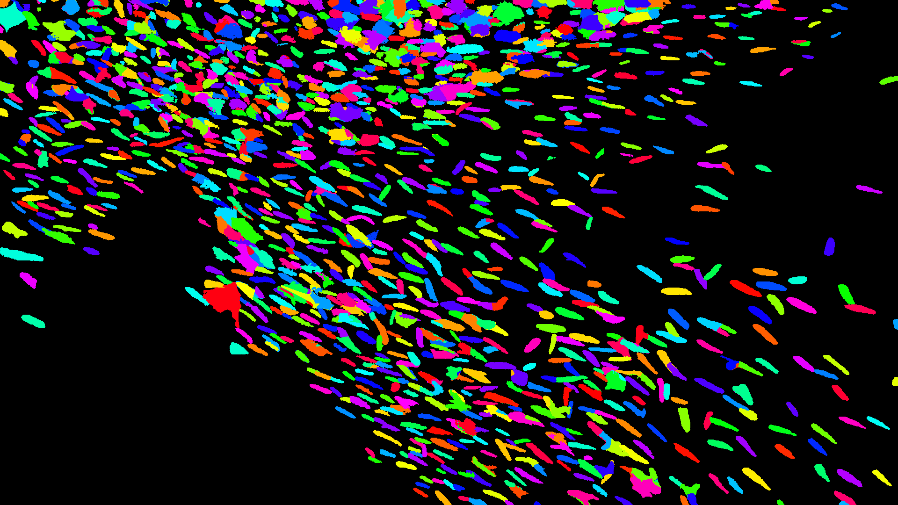
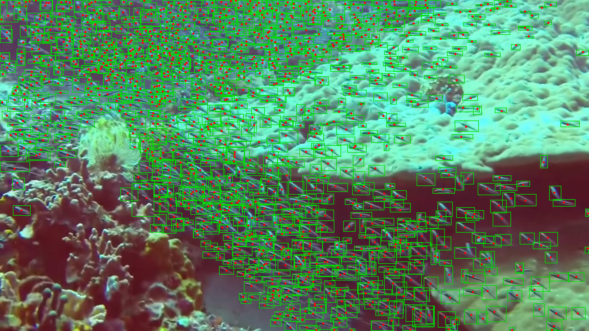
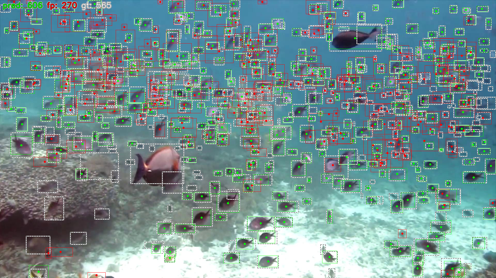
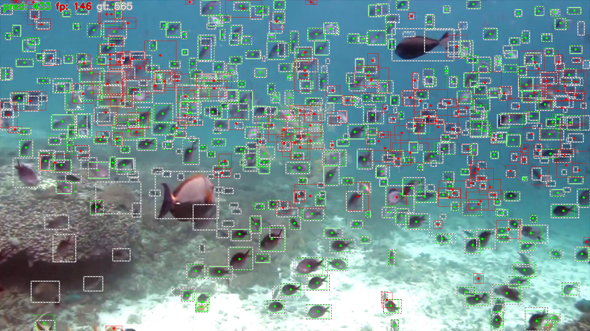

# GeCoD2 - Feww-Shot Object Counting with Depth Information

This repository contains the code accompanying the diploma thesis *A neural network for
object counting in color images using depth information* (Faculty of Computer and
Information Science, University of Ljubljana). The detection-based few-shot counter
**GeCo2** is extended with depth information; the extended model is called **GeCoD2**.

## Background: GeCo2

[GeCo2](https://arxiv.org/abs/2511.08048) (AAAI 2026) is a few-shot detection-based
counter: given an image and a few exemplar bounding boxes, it detects and counts all
objects of the exemplar category. It builds a generalized-scale dense query map that is
gradually aggregated across the backbone (SAM2 Hiera) feature pyramid, interacts it with
exemplar appearance and shape prototypes at each level, and predicts boxes from the
high-resolution query map
([official code](https://github.com/jerpelhan/GECO2/),
[demo](https://huggingface.co/spaces/jerpelhan/GECO2-demo)).

A weakness of counters that predict only from the color image is a drop in accuracy in
scenes where objects blend into their surroundings or densely overlap. GeCoD2 addresses
this by feeding the model depth information estimated from the very same color image.

## What GeCoD2 adds

**Depth acquisition.** A pretrained monocular depth estimator (Depth Anything V2, ViT-L)
supplies two signals: a one-channel relative-depth map and the 256-channel output of the
last DPT decoder stage, reduced to 8 channels with a per-dataset PCA basis. Because
single low-resolution inference merges small objects into the background, the depth map
is computed at four resolutions (shorter side 512/768/1024/1280), averaged and min-max
normalized. Both signals are precomputed once per image and cached.

<p>



</p>

*Left to right: RGB input, depth map, depth features (first 3 PCA components). In the
depth features, animals that are barely discernible in the RGB image stand out as
bright silhouettes.*

**Five depth-fusion variants** (each in its own directory under `experiments*/`):

| Variant | Code name | Fusion |
|---|---|---|
| GeCoD2-add | `conv_depth_add` | adapter-projected depth features added element-wise to the RGB features at every pyramid level |
| GeCoD2-cat | `conv_hiera` | depth features concatenated with RGB features channel-wise, a conv maps back to the original width -- **best on all three datasets** |
| GeCoD2-ffm | `ffm` | BiSeNet-FFM-style fusion: concat, conv + norm + activation, channel attention, gated addition |
| GeCoD2-in | `depth_dim` | input-level injection: RGB + depth concatenated to 4 channels, a 1x1 conv maps back to 3 before the frozen backbone |
| GeCoD2-sep | `sep_hiera` | a separate frozen backbone copy runs on the depth image; its pyramid is added through learnable gates |

All fusion convs are warm-started (identity over RGB, zeros over depth), so training
begins exactly at the depth-free model; the ablations show this warm start is essential.

**Zero-shot counting.** For datasets without exemplars (IOCfish5K) the exemplar
prototypes are replaced with directly learnable prototype tokens at each of the three
feature levels.

**Density estimation and density-guided detection.** A light density head predicts a
density map whose integral serves as a second count estimate for dense scenes; the
predicted map can additionally be injected into the query map through a zero-initialized
gate to guide detection (`densg`).

**Automatic box annotation from points (SAM 3).** IOCfish5K annotates objects only with
center points. A cascaded procedure prompts SAM 3 with the points -- full image first,
then shrinking context crops sized by local point density, a second pass on the
color-coded depth image, negative prompts from neighboring points, and Voronoi-style
splitting of masks that grab neighbors -- so that every point yields exactly one
bounding box. The resulting pseudo-labels enable training detection-based counters on
the dataset (`IOCfish5kDataset/SAM3_hpc_annotation.py`).

<p>



</p>

*Left to right: input image with 1358 objects, masks obtained by the cascaded SAM 3
procedure, input point annotations (red) with the derived bounding boxes (green).*

## Results

Test-set MAE (lower is better). The "same-recipe baseline" is GeCo2 trained with exactly
the same schedule but without depth, so the depth contribution is isolated.

**FSCD-147** (few-shot box counting)

| Model | MAE | RMSE |
|---|---|---|
| GeCo2 (published) | 7.64 | 39.39 |
| GeCo2 (same-recipe baseline) | 7.76 | 37.81 |
| **GeCoD2-cat** | **7.42** | 42.17 |

GeCoD2-cat surpasses the published GeCo2 by 3 %, mainly by raising precision
(0.791 vs 0.780). On images with fewer than 1500 objects: MAE 5.84 vs 6.15.

**MCAC** (multi-class counting)

| Model | MAE | RMSE |
|---|---|---|
| LOCA | 10.91 | 22.04 |
| ABC123 | 9.52 | 17.64 |
| GeCo2 (paper) | 7.93 | 17.05 |
| GeCo2 (same-recipe baseline) | 11.13 | -- |
| **GeCoD2-cat + densg** | **8.75** | 17.94 |

GeCoD2-cat with density guidance surpasses the published ABC123 by 8 %. Selecting the
checkpoint by density error gives density-integral MAE 8.29 while keeping box MAE at
9.13, so a single model beats ABC123 on both measures. The published GeCo2 paper number
(7.93) remained out of reach under the available training budget.

**IOCfish5K-D** (indiscernible underwater scenes, zero-shot)

| Model | MAE | RMSE | NAE |
|---|---|---|---|
| IOCFormer (density, RGB) | 17.12 | 41.25 | 0.38 |
| IOCFormer-D (density, RGB+depth) | 16.80 | 40.60 | 0.33 |
| GeCo2 (same-recipe baseline, boxes) | 33.99 | 91.80 | 0.649 |
| **GeCoD2-cat** (boxes) | **32.07** | **88.77** | **0.489** |

GeCoD2-cat reduces box-count MAE by 6 % over the equally trained GeCo2, almost entirely
by suppressing false positives (precision 0.526 -> 0.553). Detection-based counting
still trails the specialized density regressors on this extremely dense dataset,
although the density-head NAE approaches IOCFormer-D (0.30 vs 0.33). The gain from depth
is largest on images with fewer than 200 objects (13 %) and shrinks in the densest
scenes (2 %).

<p>


</p>

*Left: the GeCo2 baseline makes 606 predictions for 565 animals (270 false positives).
Right: GeCoD2-cat makes 433 predictions with the false positives nearly halved (146).*

## Repository layout

- `models/`, `utils/` -- GeCo2 model code with the depth-fusion variants, density head, zero-shot prototypes, losses, metrics
- `Depther/` -- frozen monocular depth suppliers (Depth Anything V2, vendored)
- `experiments/`, `experiments_fscd/`, `experiments_mcac/` -- one training script per fusion variant and dataset (IOCfish5K / FSCD-147 / MCAC)
- `training/` -- run configs (`config_*.sh`), SLURM train+inference drivers, whole/tiled inference scripts
- `IOCfish5kDataset/` -- SAM 3 point-to-box annotation pipeline and dataset viewer
- `tools/` -- result parsing, analysis and visualization utilities
- `sam2/`, `Deformable-DETR/` -- vendored upstream dependencies

## Citing GeCo2

This project builds directly on GeCo2
([paper](https://arxiv.org/abs/2511.08048),
[official code](https://github.com/jerpelhan/GECO2/)).

```bibtex
@inproceedings{pelhan2026generalized,
  title={Generalized-Scale Object Counting with Gradual Query Aggregation},
  author={Pelhan, Jer and Luke{\v{z}}i{\v{c}}, Alan and Kristan, Matej},
  booktitle={Proceedings of the AAAI Conference on Artificial Intelligence},
  volume={40},
  number={10},
  pages={8314--8321},
  year={2026}
}
```

## Acknowledgements

This work builds on [GeCo2](https://github.com/jerpelhan/GECO2/) and its
[SAM2](https://github.com/facebookresearch/sam2) backbone, with
[Depth Anything V2](https://github.com/DepthAnything/Depth-Anything-V2) as the depth
supplier and SAM 3 for annotation. Datasets:
[FSCD-147](https://github.com/VinAIResearch/Counting-DETR),
[IOCfish5K](https://github.com/GuoleiSun/Indiscernible-Object-Counting) (with the
IOCfish5K-D depth extension) and MCAC (ABC123).

---

Code was written with assistance of generative artificial intelligence.
